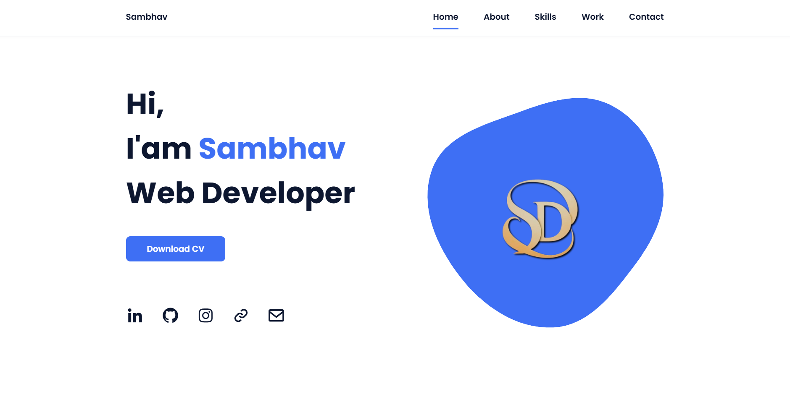
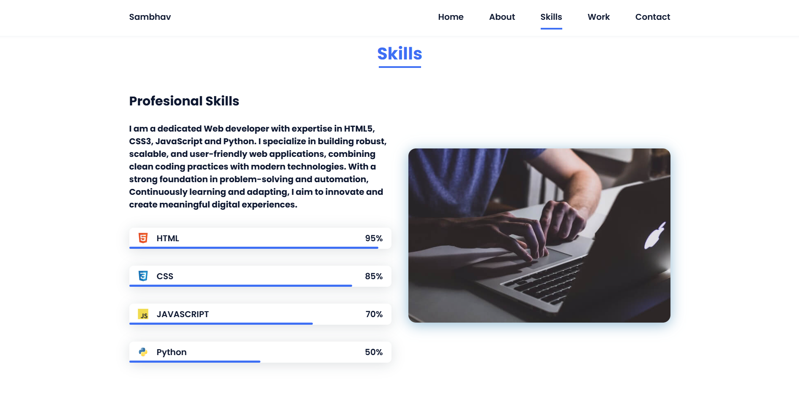
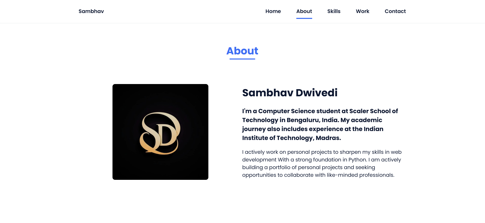
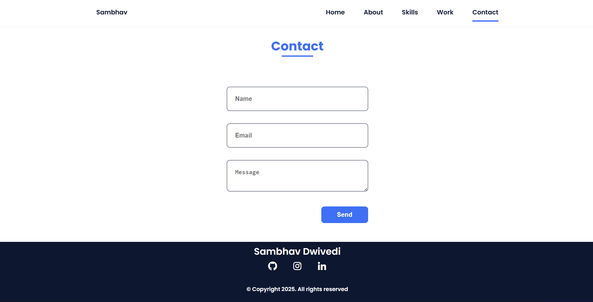

# Sambhav Dwivedi 
Portfolio Website

## Project Overview
This is my personal portfolio website showcasing my skills, projects, and professional journey.  
It provides a clean and professional look for recruiters, clients, and collaborators.

## Live Demo
Check out the live website here: [https://sambhavdwivedi.netlify.app/]

## Tech Stack
The website is built using modern web technologies:

| Frontend         | Styling         | Scripts           |
|------------------|-----------------|-------------------|
| HTML5            | CSS3            | JavaScript (ES6)  |
| Responsive Design| Flexbox & Grid  | DOM Manipulation  |
| SEO Basics       | Animations      | Event Handling    |

## Screenshots
Here are some key sections of the website:

- **Home / Introduction**  
  

- **Skills Section**  
  

- **Skills Section**  
  

- **Contact Section**  
  

## Author
**Sambhav Dwivedi**  
- Email: sambhavdwivedi@outlook.com
- GitHub: (https://github.com/sambhavdwivediofficial)  

> Note: This project is deployed on Netlify for live demo. Screenshots are included for a quick preview.
